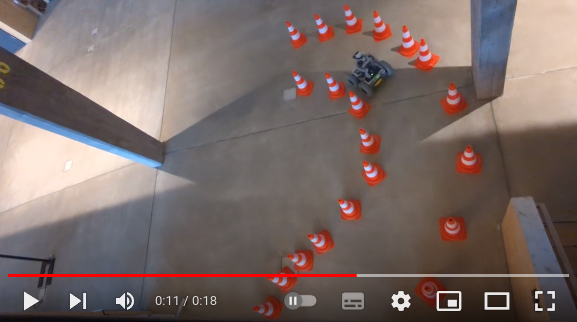

# ros2_tutorial

ROS2 humble - Tutorials for the [KBS](https://kbs.informatik.uos.de/) robotics labs in wintersemester 2023/24; Osnabrück University. A computer is needed with:

- Ubuntu 22. Only native! Dual-boot is OK.
- ROS2 humble (see first tutorial)

All examples are implemented using C++ programming language. The course is at a very beginner level. In the end you will be able to let a robot autonomously drive from A to B as shown here:

## [ex01_first_package](./ex01_first_package/)

- Learning ROS concepts
- Writing a simple subscriber and publisher
- Learning C++ and CMake by implementing subscribers and publishers in different ways
- Learn to use `vim`
- Environment variables, `.bashrc`

## [ex02_gazebo_simulation](./ex02_gazebo_simulation/)

- Start a robot! Virtually
- More ROS packaging
- RViz2
- New message: LaserScan
- Transformations: Concept, Implementation
- New message: PointCloud2
- ROS2 parameters + remapping
- XML launch files
- Fun: Steer the robot
- New message: Twist

## [ex03_state_estimation](./ex03_state_estimation/)

- Concept: State Estimation via
  - Wheel Odometry
  - IMU
  - LiDAR
  - Camera
- Fusion
  - Kalman-Filter
  - `robot_localization`-package
- Start a robot! In reality.
- Tool: `tmux`
- Mapping
  - Maps
  - SLAM

## [ex04_navigation](./ex04_navigation/)

- Localization in given maps
- Nav2
- Actions: Interfaces, Servers, Clients
- Trigger Nav2 action servers via C++-Nodes

## [ex05_behavior_trees](./ex05_behavior_trees/)

!! Unfinished !!

- Overview: Deliberation Layer
- BehaviorTree.CPP
- Simple Behavior Tree
- Simple Behavior Tree with Groot monitor
- Writing Behavior Tree Plugins

TODOs:

- Editing/creating trees using Groot
- Using the Blackboard

More TODOs in ex05 README.

## Information for Teachers

Further information for teachers: [Click here](TEACHERS.md).