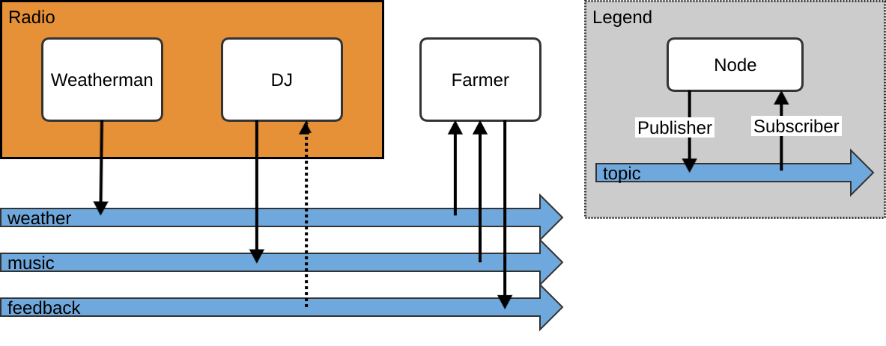

# ex01_first_package

ROS is short for Robot Operating System. It is a framework/middleware for the quick development of software related to robotics.
It provides the infrastructure for sensor and actuator communications, sensor data handling, serialization, visualizations, and software packaging.
All these things don't change for different types of robots.
Roboticists are happy
- to not implement everything from scratch for every robot they have,
- that they can use other software that was already implemented somewhere in the world.

ROS1 was invented in 2007. It was mostly used in research and is completely open-source. Some design choices were considered bad. In addition, it had no guarantees in real-time executions nor in how safe communications were. Maybe because researchers don't care about that. But industry does. Recently ROS2 was released in 2017, seeking to overcome exactly those issues.

With the following set of repositories, we try to explain the basic ROS concepts by example. 

## ROS2

To continue a computer with natively installed Ubuntu 22.04 is required. Come back if you find one.

Great to see you have found one. Now install ROS2 humble with the following steps (official instructions: https://docs.ros.org/en/humble/Installation/Ubuntu-Install-Debians.html)

Open a terminal:

### Useful packages

```
sudo apt-get install vim
```

### Preparation

```console
locale  # check for UTF-8

sudo apt update && sudo apt install locales
sudo locale-gen en_US en_US.UTF-8
sudo update-locale LC_ALL=en_US.UTF-8 LANG=en_US.UTF-8
export LANG=en_US.UTF-8

locale  # verify settings
```

```console
sudo apt install software-properties-common
sudo add-apt-repository universe
```

```console
sudo apt update && sudo apt install curl -y
sudo curl -sSL https://raw.githubusercontent.com/ros/rosdistro/master/ros.key -o /usr/share/keyrings/ros-archive-keyring.gpg
```

```console
echo "deb [arch=$(dpkg --print-architecture) signed-by=/usr/share/keyrings/ros-archive-keyring.gpg] http://packages.ros.org/ros2/ubuntu $(. /etc/os-release && echo $UBUNTU_CODENAME) main" | sudo tee /etc/apt/sources.list.d/ros2.list > /dev/null
```

Refresh the package sources

```console
sudo apt update
```

Upgrade all packages you already have

```console
sudo apt upgrade
```

### Installation

Now start the ROS2-humble installation:

```console
sudo apt install ros-humble-desktop
```

Some additional dev tools:
```console
sudo apt install ros-dev-tools
```

### Environment Variables

In many situations ROS2 will need additional configuration via environment variables. A good way is to add additional environment variables to the `~/.bashrc` file (`~` is the path to your home folder). Then they will be set every time a new terminal is started. Open the file with Vim (yes with vim) and add the following line to the end of the file:

```console
vi ~/.bashrc
```

Try to insert this at the end of the file:

```console
source /opt/ros/humble/setup.bash
```

Exit Vim: https://stackoverflow.com/questions/11828270/how-do-i-exit-vim. The sooner you learn Vim the better. As soon as you restart your terminal this command will set up everything you will need for your global ROS2. Test your installation via

```console
ros2 run demo_nodes_cpp talker
```

open another terminal (Ctrl+Shift+T) and execute:

```console
ros2 run demo_nodes_py listener
```

The listener should hear what the talker is saying, even though they are not the same process, and not written in the same programming language. How this works comes soon.

## Package

A package is a piece of software that has a closed purpose. For example, one package could be a driver for a sensor, another package could handle the detection of objects in images. Now you will create your very first package. But where to put it? Into a ROS workspace.

It doesn't matter how you call it. We mostly name the workspace after the robots we are using. Since we are later using the "ceres" robot we are calling the workspace `ceres_ws`:

```
user@pc:~$ mkdir ceres_ws
```

all packages will be placed within a `src` folder inside of this package:

```
ceres_ws/
  src/
    package1/
      package.xml
      CMakeLists.txt
      ...
    package2/
      package.xml
      ...
    folder/
      package3/
        package.xml
        CMakeLists.txt
        ...
      package4/
        package.xml
        ...
    ...
```


```console
user@pc:~$ cd ceres_ws
user@pc:~/ceres_ws$ mkdir src 
```

Source your new workspace by adding the following line to the end of your `.bashrc`:

```
source ~/ceres_ws/install/setup.bash
```

Then create a package:

```console
user@pc:~/ceres_ws$ cd src
user@pc:~/ceres_ws/src$ mkdir ex01_first_package
user@pc:~/ceres_ws/src$ cd ex01_first_package
```

A folder becomes a ROS package once you put a package.xml into it.

```console
user@pc:~/ceres_ws/src/ex01_first_package$ touch package.xml 
```

```console
user@pc:~/ceres_ws/src/ex01_first_package$ vi package.xml
```

Open the <a href="./package.xml" target="_blank">`package.xml`</a> file of this repository to see its contents.

Everything until `license` are tags giving meta information about the package.
The rest describes what the package needs to compile successfully.
The `rclcpp` package contains everything we need to write C++ code for a robot.
So if we decide to write our software in C++, we usually depend on `rclcpp`.
The second package is `std_msgs`.
It is a package that only consists of message definitions.

## Messages & Topics

In ROS-Messages we can store and transfer data to other nodes.
For example, the message `std_msgs/msg/String` is defined <a href="https://docs.ros2.org/foxy/api/std_msgs/msg/String.html" target="_blank">here</a>.

It is a rather simple message because it only contains one field.
The description of a message is compiled into types that can be used in any supported programming language. Like this, we can use the same message in C++, write something in the data field

```cpp
#include <std_msgs/msg/string.hpp>

...

std_msgs::msg::String message;
message.data = "Hello!";
// send message ...
```

And read it via 

```python
import std_msgs.msg.String

...

msg = std_msgs.msg.String()
# receive message ...
print(msg.data)
```

Communications between Nodes are not done directly but with so-called ROS-topics in the middle.
So a `Publisher` is publishing a message on a topic. One ore multiple nodes can subscribe on the topic to receive the ROS-Message that was published on the topic before. This scheme is exceptionally well suited for sensor data:
An example from reality: ROS-sensor drivers usually access the sensor on low-level and then publish the sensor data to a topic.
For example a USB webcam driver is accessing the USB interface of the camera and reads the images. The driver doesn't care about *who* exactly needs the images, so it just publishes the image data to a topic.
Then one node wants to detect cats in the images, so it subscribes on the topic, another node wants to filter the image so that only edges remain, so it subscribes on the topic. Maybe in the future, someone implements some new nodes doing cool things with the images, so they will subscribe to the image topic.
But the image driver never needs to be changed for that.
And on the other side, the image processing nodes will never know there is a USB-interface existing.

Another example is a Radio station where someone is broadcasting something without caring about who is actually receiving it:



### Publisher

The next task deals with implementing our own publisher node for our package. It should publish a `std_msgs/String` on a topic called `important_messages`. So the Node acts similarly to the sensor-driver-Node described before (except accessing a USB-interface).

Read <a href="./src/publisher.cpp" target="_blank">`src/publisher.cpp`</a> and try to replicate the contents into your own node. Try without copy-paste.

After writing this file we need to add some instructions to compile the C++ project. ROS internally using CMake for that. So create a `CMakeLists.txt` at the base folder of your package and add the following contents:

```cmake
cmake_minimum_required(VERSION 3.8)
project(ex01_first_package)

###########################
# Not important to know start

# Default to C++14
if(NOT CMAKE_CXX_STANDARD)
  set(CMAKE_CXX_STANDARD 14)
endif()

if(CMAKE_COMPILER_IS_GNUCXX OR CMAKE_CXX_COMPILER_ID MATCHES "Clang")
  add_compile_options(-Wall -Wextra -Wpedantic)
endif()

# Not important to know end
###########################

# 'find_package' trys to find packages
# usually all dependencies of the package.xml file 
# should occour here too
find_package(ament_cmake REQUIRED)
find_package(rclcpp REQUIRED)
find_package(std_msgs REQUIRED)

# Compile our node!
add_executable(publisher src/publisher.cpp)

######
# Properly add ROS dependencies
# - header files become available in code
# - libraries are linked
ament_target_dependencies(publisher 
  rclcpp
  std_msgs)

#######
# at execution time ROS2 only knows about things exist
# in the install directory 'ceres_ws/install/...'
# So we install our executables to 'ceres_ws/install/...'
# via
install(TARGETS
    publisher
  DESTINATION lib/${PROJECT_NAME})

# and finish with do ament_package cleanup
ament_package()
```

The comments explain roughly what is going on during compilation.
If you are interested you can read them. But from my experience, you will be good if you just copy-paste those commands. If you understand everything else you can come back to it.
Now go to your workspace's base directory and call

```console
user@pc:~/ceres_ws$ colcon build
```

If no errors occur the compilation has been successful. After that, you can run your node by calling

```console
ros2 run ex01_first_package publisher
```

Open a second terminal (Ctrl + T) and enter 

```console
ros2 topic list
```

to list all the topics that are available. The topic `important_messages` should appear. With 

```console
ros2 topic echo /important_messages
```

You can print the (important) messages from the topic.

### Subscriber

Now we want to receive the message in a self-written program. Imagine you want to write a Node that subscribes to an Image to detect cats. But in this example it is a stream of strings:

Read <a href="./src/subscriber.cpp" target="_blank">`src/subscriber.cpp`</a> and try to replicate the contents into your own node. Try without copy-paste.

Afterward, try adding your cpp file to your `CMakeLists.txt` for compilation. Then call `colcon build` again. If you are not manage to fill out the `CMakeLists.txt` correctly, get yourself help by reading the `CMakeLists.txt` from this repository.

When it compiles, test your program by calling

First Terminal:
```console
ros2 run ex01_first_package publisher
```

Second Terminal:
```console
ros2 run ex01_first_package subscriber
```

The subscriber should always print the most recent messages that were sent by the publisher. Even after starting ending and restarting the subscriber.

### Better Publisher & Subscriber

Further examples are in `src` folder of this repository. All publishers are doing exactly the same. As well as all subscribers are doing exactly the same. `publisher_class.cpp` and `subsriber_class.cpp` are the recommended styles of writing nodes. It's done by inheriting from `rclcpp::Node`.

Read it, understand it, execute it.

## Last Words

One node does not need to be a subscriber or publisher alone. A node can also be composed of multiple subscribers and publishers.
ROS has more useful tools like `ros2 topic list` or `ros2 topic echo`.
To see them just type `ros2 topic` and press enter.
Test the commands with your topics.


### Data Distribution Services

The default DDS that is used by ROS is `FastDDS`. In our tests, it tends to be unstable in networks. Luckily, we can switch to another implementation called `CylconeDDS` by installing it:

```console
sudo apt install ros-humble-rmw-cyclonedds-cpp
```

And enabling it by adding the following lines to your `.bashrc`:

```bash
# export RMW_IMPLEMENTATION=rmw_fastrtps_cpp
export RMW_IMPLEMENTATION=rmw_cyclonedds_cpp
```

Then restart your computer OR the ROS daemon

```console
ros2 daemon stop
ros2 daemon start
```

Now try if your nodes are still working.


Not required but just in case: If you want to recover the default `FastDDS` use: 
```bash
export RMW_IMPLEMENTATION=rmw_fastrtps_cpp
```

