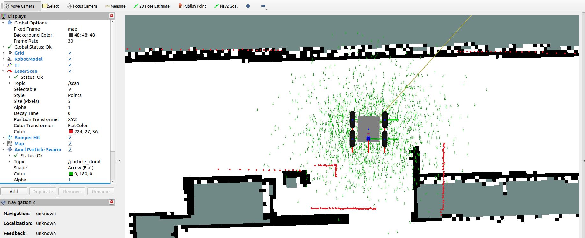
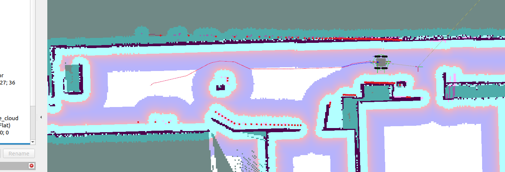
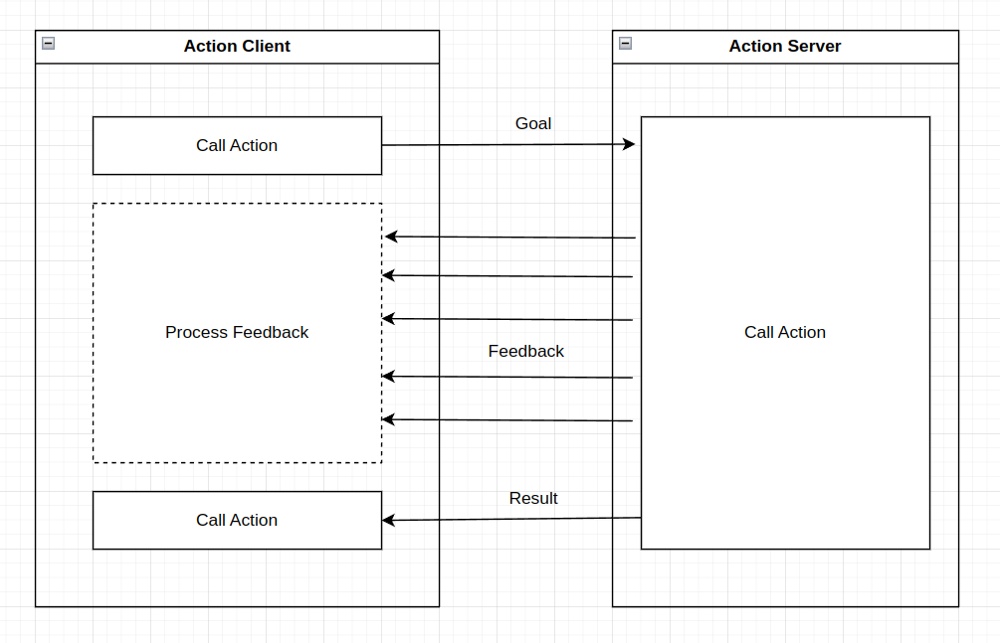

# ex04_navigation

In exercise 03 you managed to build a 2d grid map from the environment and store it on the disk. We already did that so we continue to use our pre-recorded map from now on. It is located in

- `uos_tools/uos_maps/maps/cic.png`
- `uos_tools/uos_maps/maps/cic.yaml`

and for the gazebo simulation its:

- `uos_tools/uos_maps/maps/avz.pgm`
- `uos_tools/uos_maps/maps/avz.yaml`

Make yourself familiar with the map format. What is written in the yaml files? What message type is published on `/map` while doing SLAM?

## Localization

In an existing map we normally do [monte carlo localization](https://en.wikipedia.org/wiki/Monte_Carlo_localization) (MCL). You can start it by calling

```console
ros2 launch ceres_gazebo amcl_avz_launch.xml
```

or on the real robot with

```console
ros2 launch ceres_bringup amcl_cic_launch.xml
```

Use the preconfigured RViz to load everything you need into your RViz window:

```console
rviz2 -d ceres_ws/src/ceres_robot/ceres_util/rviz/nav2_default_view.rviz
```

Then press `2D Pose Estimate` to give the robot a rough estimate of its pose in the map. Now you should see the scan appearing as well as a green particle cloud.




The particle cloud represents the state of the robot inside of AMCL. The more the particles are spreading, the more the robot is uncertain about its state in the map. As soon as you start to drive the robot around, the particle cloud should become smaller and the scan aligns the map better. Task: Try that.

### Theory

A belief state is the state of the robot that is estimated based on actions and measurements. Once the robot is successfully localized, the belief state matches the real state.
Markow localization was invented because people figured out that a unimodal belief state (like a Kalman-Filter has) insufficiently models some parts of the localization problem. 
Markow localization has a multimodal belief state representation but has the disadvantage, that the state is only allowed to be discrete. Monte-Carlo localization (MCL) overcomes this disadvantage by utilizing a particle filter. MCL uses a set of particles to describe the belief state. This table gives an overview:


| Algorithm | Belief State | State space |
|:---------:|:------------:|:-----------:|
|  KF       |  unimodal    | continuous  |
|  SLAM     |  unimodal *  | continuous  |
| Markow    |  multimodal  | discrete    | 
|  MCL      |  multimodal  | continuous  |

In many cases, it is not required to have multiple modes in the belief state. But sometimes it is. For example when doing global localization. Normally, the computational effort increases when doing MCL over SLAM.

(*) The term SLAM - simultaneous localization and mapping - does not exclude the usage of multimodal belief states. However, most of the recent SLAM software has an underlying unimodal belief state. Some SLAM approaches add past pose estimates to the belief state; its dimensionality is growing with each pose added. If interested, search for pose graphs or factor graphs.


MCL ([Wikipedia](https://en.wikipedia.org/wiki/Monte_Carlo_localization)):


Bimodal Distribution ([Wikipedia](https://en.wikipedia.org/wiki/Multimodal_distribution)):


## Nav2

Given the localization in the map, it becomes possible to plan and follow paths from the robot's position to a given goal somewhere else in the map. There is a package exactly handling that: nav2. Browse a bit on their website: https://navigation.ros.org/. In this exercise, you will start a preconfigured nav2 launch file to let the robot for the first time autonomously drive through the map.

```console
ros2 launch ceres_navigation nav2_launch.py
```

Now open the preconfigured RViz again. Once the robot is localized, you can set a goal pose somewhere in the map using `Nav2 Goal` or `2D Goal Pose`. Then the robot should drive safely from A to B while avoiding dynamic obstacles.



You can test obstacle avoidance by placing random objects in the Gazebo simulation or in the real world.


### Theory

Navigation in 2D Grid Maps is usually done by first planning paths from A to B and after that following the paths using controller. Planning paths is done by using so-called "Global Planner". Letting the robot follow the path is done by so-called "Local Planner". Both global planner and local planner implementation can be switched inside the nav2 parameters. Search for the nav2 config file that is used by the ceres robot and find out which global and local planner algorithm is used.

Additionally, nav2 uses so-called cost-layers on top of the regular grid map. With a cost-layer dangerous zones can be defined.


#### Inflation Layer

To make computations simpler, the walls in the map are inflated by the robot's radius. Like this, the robot can be considered as a point. Assuming the robots are looking like circles. 

## Actions

What you implemented so far are programs that run forever. For example, converting messages from topics to another topic. But some tasks of the robot have an end. For example, driving from A to B. Such a task is also referred to as an "action". For this ROS2 implements action interfaces to use. It is splitted into action servers and action client. The action server is always executing the action (like driving from A to B). The action client is triggering the action and can receive feedback by the action server of the current progress of the action:



Additionally, the client can send signals to the server to cancel the action. For example, if during the drive from A to B the plans have changed. So the action client oftentimes acts as a monitor.


### Own action

Together with messages, actions are one part of the ROS2 interface system. 
You can find the following code samples in the package `ex04_msgs`.

The minimum information that is shipped with an action is if it was successful, aborted or canceled. In addition, we can define custom fields for the goal, result, and feedback:

`ex04_msgs/actions/WaitForX.action`:
```
# goal
float32 duration
---
# result
---
# feedback
```

The package `ex04_msgs` shows a minimal example of how to compile those actions. Help yourself by looking into the `CMakeLists.txt` and `package.xml`.

### Own action server

`WaitForX` and `WaitForRvizPose` are action interfaces. This means they can be used independently from the programming language to trigger an action server to do something. In this task, you will write an action server that will handle the logic around:

`WaitForXActionServer`:
- `WaitForX` action goal comes from someone (client)
  - The action server will wait for X seconds
  - Returns `SUCCEEDED` once it has finished
- File: `ex04_actions/src/wait_for_x_action_server.cpp`

`WaitForRvizPoseActionServer`:
- `WaitForRvizPose` action goal comes from someone (client)
  - The action server will wait until something is published on `/goal_pose`. The `2D Nav Goal` of RViz is publishing a `geometry_msgs/PoseStamped` on this topic.
  - If a pose was received. Return it with the outcome `SUCCEEDED`
  - If no pose was received and a certain time was exceeded return `ABORTED`
- File: `ex04_actions/src/wait_for_rviz_pose_action_server.cpp`

Start the action servers via:

```console
ros2 run ex04_actions wait_for_x_action_server
```

You can test your server implementations by using the following command line tools:

```console
ros2 action send_goal /wait_for_x ex04_msgs/action/WaitForX "{duration: 4.0}"
```

Try the same with the `/wait_for_rviz_pose` action server.

### Own action client

Instead of using the command line tools. In this task, you will call your action servers with a self-made action client using C++. File: `ex04_actions/src/wait_for_x_client`. Read, understand and execute the code. 

### Nav2 action client

Given the knowledge of how to implement action clients you can now start to write code that executes different actions from different packages. Nav2 for example provides action interfaces and servers for different navigation-related actions:

1. start the simulation (or the robot). Start AMCL. Start Nav2

2. Enter `ros2 action list` to list all the action server available. The most important ones you will need for now are:

|  Action  |  Type   |
|:--------:|:-------:|
| `/compute_path_to_pose` | Executes the global planner. Goal Pose -> Path  |
| `/follow_path` | Executes the local planner. Follow a given path. |
| `/navigate_to_pose` | Shortcut: Global and local planner. |

In our next node we will try to trigger the shortcut action `/navigate_to_pose` so that the robot will drive forever in a loop between certain poses in the map.

It is already implemented in `ex04_nav2_client/src/nav2_client.cpp` you can start it via

```console
ros2 run ex04_nav2_client nav2_client
```

### Send RViz goal to Nav2

Write a node that uses a `WaitForRvizPose` action client to retrieve a pose from RViz. Then pass the pose to the Nav2 action client to let the robot drive to that goal.


TODO: Figure out how to disable that nav2 receives a pose from RViz (Maybe just a remap?)
