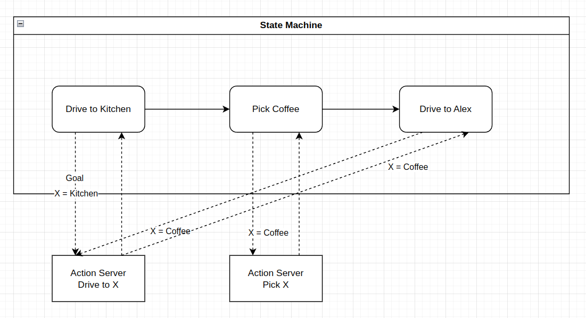

# ex05_behavior_trees

## Deliberation Layer

Action clients are normally implemented inside of high level robot control software, sometimes referred to as [deliberation layer](https://github.com/ros-wg-delib/awesome-ros-deliberation). The two most well-known concepts of deliberation are state machines and behavior trees. A state machine normally consists of a lot of action clients and connects them via transitions:

While I prefer the concept of state machines, the current trend in the ROS community is to use behavior trees. For behavior trees the concept stays the same. Nodes in the behavior tree should trigger and monitor the actions the robot provides. More to this later. We will start with creating own actions and action server.

## BehaviorTree.CPP

### First Behavior Tree

Splitted:
- `ex05_bt_plugins`: only for bt-nodes as plugins for the behavior tree library
- `ex05_behavior_tree`: Loading the nodes and execute a behavior tree

### Monitor using Groot

https://github.com/BehaviorTree/Groot.git

### Editing using Groot

TODO: Create a new behavior tree using Groot editor.
- Load the nodes from `ex05_bt_plugins`
- Create a behavior tree
- Put it into a new node and monitor it

### Blackboard

TODO: Trigger own wait for pose action from a new behavior tree node (bt-node). Write the result in a blackboard entry

Caution! Bt-nodes are not the same as ROS-nodes!

### Use nav2 actions

TODO: 
- Load the Nav2 plugins into Groot editor
- Load our plugins into the Groot editor
- Create a BT that connects the results of our wait-for-pose bt-node with a Nav2 compute path bt-node
- Try to create a tree that does the following:
  - Wait for pose
  - Compute path
  - Follow path

